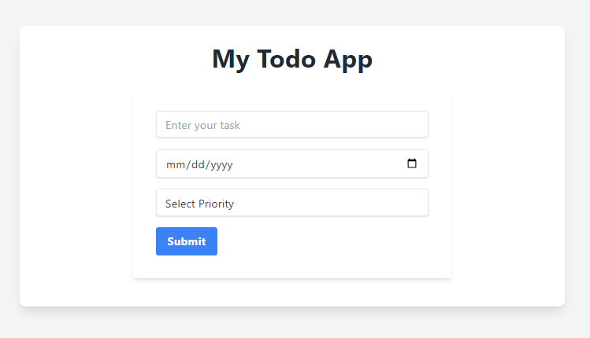
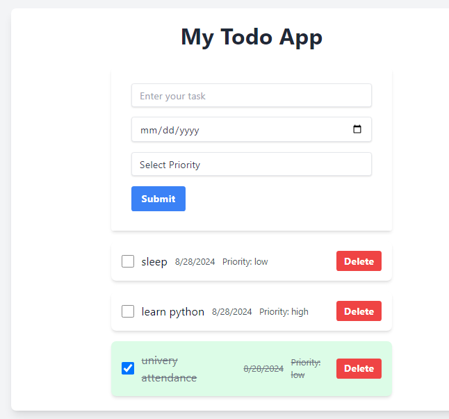

Here's the updated `README.md` with instructions on where to add project screenshots and how to reference them:

---

# redux-todoApp

## Overview

`redux-todoApp` is a modern task management application built with React, Redux, and Tailwind CSS. This application allows users to add, manage, and delete tasks with a clean and responsive user interface. It leverages Redux for state management and Tailwind CSS for custom styling.

## Features

- **Add Tasks**: Easily add new tasks with descriptions and due dates.
- **Mark Tasks as Done**: Toggle tasks as completed, which updates the background color and text style.
- **Delete Tasks**: Remove tasks from the list.
- **Display Date and Priority**: Show the due date and priority level for each task.

## Technologies Used

- **React**: JavaScript library for building user interfaces.
- **Redux**: State management library for managing application state.
- **Tailwind CSS**: Utility-first CSS framework for custom designs.
- **Redux Toolkit**: Simplifies Redux development and state management.

## Getting Started

To clone and run this project locally, follow these steps:

### 1. Clone the Repository

```bash
git clone https://github.com/inaveed-git/redux-todoApp.git
cd redux-todoApp
```

### 2. Install Dependencies

Ensure you have [Node.js](https://nodejs.org/) and [npm](https://www.npmjs.com/) installed. Install the project's dependencies by running:

```bash
npm install
```

### 3. Run the Application

Start the development server with:

```bash
npm start
```

Navigate to `http://localhost:3000` in your browser to view the app.

### 4. Build for Production

To create a production build of the app, run:

```bash
npm run build
```

This command generates a `build` directory containing the production-ready files.

## Folder Structure

- **`src/`**: Contains all source files.
  - **`components/`**: React components for the app.
    - **`Form.jsx`**: Component for adding new tasks.
    - **`Todo.jsx`**: Component for displaying and managing tasks.
  - **`features/`**: Redux slice for managing todo state.
    - **`todo/todoSlice.js`**: Redux slice with actions and reducers for todo management.
  - **`app/`**: Redux store configuration.
    - **`store.js`**: Configures the Redux store.
  - **`App.jsx`**: Main application component.
  - **`index.js`**: Entry point of the React application.
  - **`assets/`**: Directory for static assets, including screenshots.
    - **`screenshots/`**: Place your project screenshots here.

## Screenshots

To provide a visual overview of the project, you can add screenshots to the `src/assets/screenshots/` directory. Reference the images in the `README.md` as follows:

```markdown
## Screenshots

### Main Screen



### Task Detail


```

Ensure that you replace the placeholder image paths with the actual paths to your screenshots.

## Usage

- **Add a Task**: Enter a task description and due date, then click "Submit".
- **Mark as Done**: Click the checkbox next to a task to mark it as completed. The task's appearance will update.
- **Delete a Task**: Click the "Delete" button next to a task to remove it.

## Contributing

Feel free to fork the repository and submit pull requests. Contributions are welcome!

## Contact

For questions or feedback, please reach out to me at [inaveed.contact@gmail.com].
